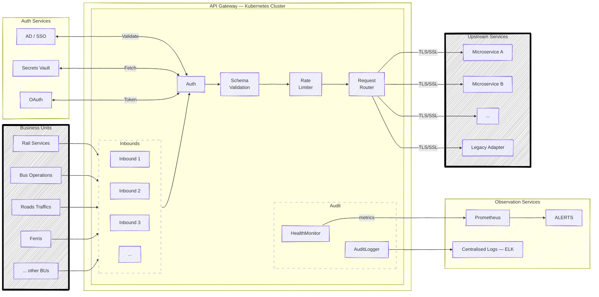

# Additional questions

### You are leading the modernisation of a critical legacy application to cloud-native architecture. Outline your approach to planning this transformation, including key considerations for security, scalability and business continuity. What risks would you identify and how would you mitigate them?

**Phase 1**

I would start the migration process by learning the current system thoroughly: data flows, processing logic, integration points, downstream dependencies, user volumes, and SLA requirements to build a clear understanding of what the system currently does before touching anything. I understand that a primary measure of success is keeping every output of the new system identical to the existing one.

During the learning phase, I will also set up the TDD (Test-Driven Development) foundation, including a draft system design together with the most important test suites that the new system must satisfy. TDD does require extra time at the beginning, but it plays a critical role as the project matures — the test suites become the first line of defence on a developer's local machine and the automated safeguard in the CI/CD pipeline on the cloud environment.

At the end of the learning phase, I will be able to identify which parts of the legacy system need to be modernised most urgently. The most common problem is a monolithic architecture that worked well at small scale but slows down as the system grows. Another common cause is an outdated part of the tech stack. The most difficult scenario is when the core logic has become inefficient after numerous patches and extensions over years of operation.

**Phase 2**

Based on the above analysis, I will propose a suitable architecture design to address each identified problem.

To modernise a monolithic system into a microservice architecture, additional interface layers will be introduced between components — these could be RESTful APIs, a high-speed message broker, or additional database schemas, depending on system requirements. Each layer will then be containerised and deployed independently using Kubernetes, Terraform, or serverless cloud functions. Containerisation is also the right answer when a specific part of the tech stack becomes outdated — we only need to work on one container to upgrade its functionality while keeping the rest of the system stable.

If an inefficient core — such as excessive memory consumption, slow computation, or regular crashes — is confirmed as the root cause, that is the hardest case and requires fixing the inefficiency before making the system cloud-native. I would request that the test suites be completed first to cover as much of the core system's functionality as possible, because we are replacing the old core entirely while still requiring the new system to produce identical outputs and behaviours. The development phase then investigates the inefficiencies closely from multiple angles, with thorough documentation to ensure the team understands why the code was originally written the way it was. Once the core is fixed, the path forward is the same as for a monolithic system.

**Phase 3**

Phase 3 is deployment, where the key requirement is minimising interruption during the switchover. I would set up and deploy an API gateway first if one does not already exist — this allows the system administrator to smoothly redirect traffic to the new system once it is confirmed safe, or switch back to the existing system instantly if unexpected problems occur. The new system is deployed as containerised services behind this switch and tested thoroughly before go-live. In cases where the core system is critically degraded and must be migrated to the cloud as a priority, I would propose lifting it to a cloud environment with at least double its current resource requirements. It may not be cloud-native yet, but it will have the headroom to run stably and buy the team the time needed for proper modernisation work.

**Security considerations:**

Security needs to be addressed from day one, not added as an afterthought. All inter-service communication will be encrypted with TLS/mTLS; network access and privileges for each service must be tightly scoped so that a compromised component cannot escalate access across the system. Secrets such as credentials and API keys will be managed through a centralised cloud vault rather than environment variables or config files in source control. Every significant action will be recorded in an audit log. A penetration test and security review will be conducted before each environment promotion to catch vulnerabilities before they reach production.

**Scalability considerations:**

Kubernetes is the primary tool for scalability in this architecture. Its horizontal pod autoscaler automatically adds container replicas during peak hours and removes them when traffic is low, meaning the system absorbs demand spikes without manual intervention. All services are designed to be stateless so any replica can handle any request — session state is externalised to a managed cache such as Redis. On the data side, read replicas and connection pooling are introduced for high-load database paths to prevent the database from becoming a bottleneck as the system grows.

### Our team needs to implement a new secure API gateway solution that will be used across multiple business units. Draft a technical design proposal that addresses security requirements, scalability needs and integration considerations. Include your approach to documentation and knowledge sharing.

A cross-BU API gateway is essentially a single front door that every business unit passes through — it must be secure enough to protect sensitive data, flexible enough to handle diverse upstream systems, and observable enough that operations teams can diagnose issues quickly.

**Proposed Architecture:**

**Security Requirements:**

All traffic from business units will have to go through Authentication block — no plain HTTP is accepted. Authentication is handled via 3 common methods: AD (Active Directory) / SSO (Single Sign-On) for human interactions, Secret Vault for other cloud appilcations, OAuth token can be used for both cases. Based on my system desgin understanding, I would like to propose the design as below:

Outbound communication from the gateway to upstream services need to have TLS/SSL enabled, meaning both sides are verified — a compromised service cannot impersonate the gateway. 

Input validation and schema enforcement happen at the gateway layer before any payload reaches a backend, protecting against injection, oversized payloads, and malformed requests. 

Every request is written to an audit log with caller identity, timestamp, endpoint, HTTP status, and response time, stored in a tamper-evident sink that satisfies NSW Government compliance requirements for audit trails.

**Scalability and Integration Considerations:**

The whole system will be implemented and packages as one Docker image, with abilities to dynamicaly configurate inbounds and outbounds through Dockerfile. Since the gateway itself will later be deployed as stateless container replicas on Kubernetes, it can scales horizontally with zero coordination — Kubernetes autoscaling adds replicas under load and removes them when traffic drops.

It's recommended that each business unit integration need to have its own access policy and security configuration, so a credential leak in one BU cannot reach another BU's endpoints. API routes are versioned (`/v1/`, `/v2/`) from the start, giving each team the ability to adopt a new contract at their own pace without a forced cutover. Request and response schemas are registered in a schema registry — any change that would break an existing consumer requires a new version rather than an in-place update, and backward compatibility is verified automatically in CI before any route change is deployed. Legacy systems that cannot be adapted to REST are wrapped in a thin adapter service that translates the gateway's expected format to the legacy protocol, keeping the code clean, clear and future-proof

**Documentation & Knowledge Sharing:**

From technical perspective, OpenAPI/Swagger specs are well-known standard, where it will auto-generated docs from code and published to an internal developer portal. Every endpoint is documented with its auth requirements, request/response schemas, and error codes — and more importantly, it's automatically generated at build time. Together with this, I understand that visual documents like flowcharts, diagrams, demos are neccessary to help onboarding new team member in shorter time.