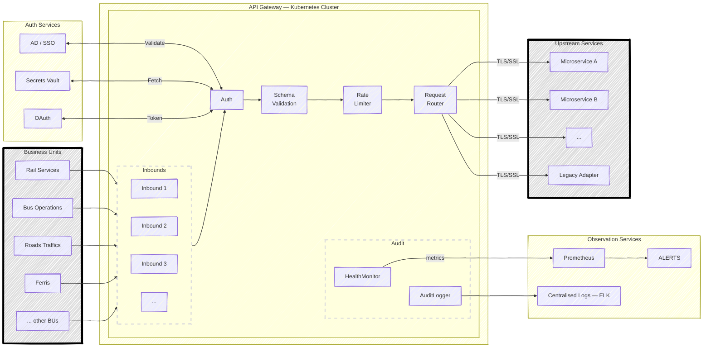

# Additional questions

### You are leading the modernisation of a critical legacy application to cloud-native architecture. Outline your approach to planning this transformation, including key considerations for security, scalability and business continuity. What risks would you identify and how would you mitigate them?

**Phase 1**

I'd start by mapping the current system thoroughly — data flows, integration points, dependencies, and SLA requirements — before touching anything. In parallel, I'll build the TDD foundation: system design drafts and key test suites that the new system must pass. TDD costs time upfront but becomes the automated safeguard in CI/CD pipelines throughout the project. By the end of Phase 1, I can identify the core problem: monolithic overload, an outdated tech stack, or years of patching degrading core logic.

**Phase 2**

For a monolith: decompose into microservices with RESTful APIs or message brokers between components, then containerise each service independently on Kubernetes. For an outdated stack: isolate and replace only the affected containers. For inefficient core logic: complete the test suites first (since we are replacing the core entirely while requiring identical outputs), investigate the inefficiencies, fix them, then follow the same containerisation path.

**Phase 3**

Deploy an API gateway first to enable instant traffic switching — to the new system on success, or back to the existing system if issues arise. The new system runs behind this switch, tested thoroughly before go-live. For critically degraded systems that cannot wait, lift to cloud with double the current resource requirements as temporary headroom while proper modernisation follows.

**Security considerations:**

All inter-service communication is encrypted with TLS/mTLS. Secrets are managed in a centralised cloud vault, never in environment variables or source control. Each service has minimum required privileges. All significant actions are written to tamper-evident audit logs. Penetration testing occurs before each environment promotion.

**Scalability considerations:**

Kubernetes HPA handles traffic spikes automatically, scaling replicas up under load and removing them when traffic drops. All services are stateless — session state externalises to a managed cache such as Redis. Read replicas and connection pooling prevent the database from becoming a bottleneck as the system grows.

---

### Our team needs to implement a new secure API gateway solution that will be used across multiple business units. Draft a technical design proposal that addresses security requirements, scalability needs and integration considerations. Include your approach to documentation and knowledge sharing.

A cross-BU API gateway is a single front door that every business unit passes through — secure, flexible, and observable enough that operations teams can diagnose issues quickly.

**Proposed Architecture:**

**Security Requirements:**

All traffic passes through the Auth block — no plain HTTP accepted. Authentication supports three paths: AD/SSO for human interactions, a Secrets Vault for service-to-service calls, and OAuth tokens for both. Outbound connections to upstream services use TLS/SSL, so both sides are verified and a compromised service cannot impersonate the gateway. Input validation and schema enforcement happen at the gateway before any payload reaches a backend, guarding against injection, oversized payloads, and malformed requests. Every request is written to an audit log with caller identity, timestamp, endpoint, and HTTP status, stored in a tamper-evident sink that satisfies NSW Government compliance requirements.

**Scalability and Integration Considerations:**

The gateway is packaged as a single Docker image with configurable inbounds and outbounds, deployed as stateless replicas on Kubernetes — autoscaling handles load spikes with no manual intervention. Each business unit has its own access policy so a credential compromise in one BU cannot reach another's endpoints. API routes are versioned (/v1/, /v2/) from the start, allowing each team to adopt new contracts at their own pace. Breaking schema changes require a new version, with backward compatibility verified automatically in CI. Legacy systems that cannot adopt REST are wrapped in a thin adapter service.

**Documentation & Knowledge Sharing:**

OpenAPI/Swagger specs are auto-generated from code and published to an internal developer portal — every endpoint documents its auth requirements, schemas, and error codes, updated automatically at build time. Architecture Decision Records (ADRs) capture the rationale behind key design choices. Visual diagrams and onboarding demos reduce ramp-up time for new team members.
