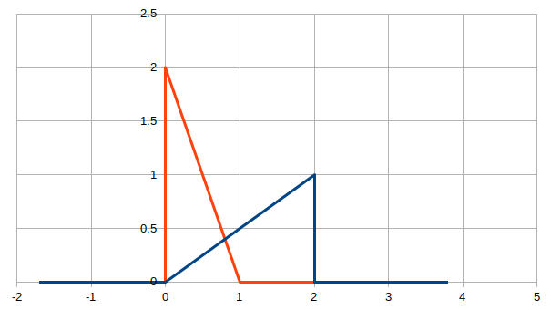

<head>
    <link rel="stylesheet" href="https://use.fontawesome.com/releases/v5.6.1/css/all.css" integrity="sha384-gfdkjb5BdAXd+lj+gudLWI+BXq4IuLW5IT+brZEZsLFm++aCMlF1V92rMkPaX4PP" crossorigin="anonymous">
    
</head>

<h1 style="text-align: center">
    Probability and Statistics 2021  
    Assignment 4 

</h1>
<h3 style="text-align: center">
    Student name: Thien Toan Tran  
    Student ID: A1808080 

</h3>

 

### Exericse 1
Given the random variable X with pdf
$$
f(x) = \begin{cases}
    x/2,    &\text {if 0 ≤ x ≤ 2}\\
    b,  &\text{otherwise}\\
\end{cases}
$$

__(a) Find the pdf of $Y = g(X) = 1 − \sqrt{4 − X^2} /2.$__

calculate Y's CDF:

$$
\begin{align*}
P(Y \leq y) &= P(1 − \sqrt{4 − x^2} /2 \leq y)\\
&=P(1 − y \leq \sqrt{4 − x^2} /2)\\
&=P((2 − 2y)^2 \leq 4 − x^2)\\
&=P(x^2 \leq 4 − (2 − 2y)^2 )\\
&=P(x \leq \sqrt{4 − (2 − 2y)^2})\\
&=\int_{x=0}^{\sqrt{4 − (2 − 2y)^2}} \frac{x}{2}dx\\
&=\left.\frac{x^2}{4}\right|_{0}^{\sqrt{4 − (2 − 2y)^2}}\\
&=\frac{4 − (2 − 2y)^2}{4}
\end{align*}
$$
Therefore
$$
F_Y(y) = \begin{cases}
    0, &\ y < 0\\
    \frac{4 − (2 − 2y)^2}{4}, &\ 0 \leq y \leq 2 \\
    1, &\ y > 2
\end{cases}
$$
calculate Y's PDF:
$
\frac{d}{dy}(\frac{4 − (2 − 2y)^2}{4}) =\frac{1}{4}*2(2-2y)*2 =2 -2y
$

$$
f_Y(y) = \frac{dF_Y(y)}{dy}=\begin{cases}
2 -2y, &0\leq y \leq 2\\
0, &\text{otherwise}
\end{cases}
$$

__(b) Sketch the probability density functions of X and Y .__
 

- $f_X(x)$ : displayed by the blue line
The support $f_X(x)$ is 
$$0 \leq x \leq 2
$$
- $f_Y(y)$ : displayed by the orange line
The support $f_Y(y)$ is 
$$0 \leq y \leq 1
$$

### Exericse 2 
**Suppose $X_1$ , . . . , $X_n$ are i.i.d. $exp(λ)$ for some $λ$ > 0 and some integer $n$ > 0. Prove that $X_1$ , the first order statistic, is $exp(nλ)$.**
Density of the minimum:
$$\begin{align*}
f_{X_1}(x) &= nf_X(x)(1-F_X(x))^{n-1} \\
&=n(λe^{-λx})(1- (1- e^{-λx}      )   )^{n-1}\\
&=n(λe^{-λx})(e^{-λx}      )^{n-1}\\
&=n(λe^{-λx})e^{-λx(n-1)}      \\
&=(nλ)e^{-(nλ)x} \\
&=exp(nλ)
\end{align*}
$$

### Exericse 3
Let $n$ be the total amount of console
Let $x_0$ be a proportion of console that have no defect
Let $x_1$ be a proportion of console that have exactly 1 defect
Let $x_2$ be a proportion of console that have more than 2 defect
$$
\begin{cases}
x_0+x_1+x_2=1\\
x_1+x_2<1 \end{cases}\\
\Rightarrow x_0>0$$
**(a) What is the probability of randomly choosing a working console, i.e. one with no defects?**
$$
P_0 = \frac{C^1_{x_0*n}}{C^1_{n}} = \frac{x_0n}{n} = x_0 = 1-x_1-x_2
$$
**(b) If 5 are chosen at random, what is the probability of getting at least one with no defects?**
Let $p_{pass}$ be the probability for getting a console with no defect
Let $p_{fail}$ be the probability for getting a console with at least 1 defect
$$\begin{align*}
p_{pass} &= 1-p_1-p_2\\
p_{fail} &= p_1+p_2
\end{align*}
$$
Apply binominal distribution, probability for getting 5 consoles, all have at least 1 defect is
$$P_{allFail}= 
\begin{pmatrix}
5\\
5
\end{pmatrix}*(p_{fail})^5*(p_{pass})^0 = (p_{fail})^5 = (p_1+p_2)^5
$$
Probability for getting at least 1 working consold is:
$$P = 1-P_{allFail}= 1-(p_1+p_2)^5
$$

**(c) Keith buys n Gameboys selected at random from the box. The cost of repairing the broken Gameboys is $C = Y_1 + 3Y_2$ , where $Y_1$ is the number with one defect and $Y_2$ is the number with more than one defect. Find the expected value and variance of $C$.**
$$\begin{align*}
C &= Y_1 + 3Y_2\\
E(C) &= E(Y_1) + E(3Y_2)
\end{align*}
$$

### Exericse 4
$$f(y_1,y_2)=\begin{cases}
k(1-y_2) & 0 \leq y_1 \leq y_2 \leq 1 \\
0 &\text{otherwise}
\end{cases}
$$

**(a) Draw a sketch of the area where the probability density function is nonzero**
The support of $f(y_1,y_2)$ is
$$\begin{cases}
0 \leq y_1 \leq y_2 \\
0 \leq y_2 \leq 1
\end{cases}
$$

**(b) What are the conditions for f to be a valid pdf? Show that for these to be true we need k = 6**
$$\begin{align*}
&\int_{0}^1\int_{0}^{y_2} k(1-y_2)dy_1dy_2 &= 1\\
\Leftrightarrow &\int_{0}^1 k(1-y_2)\int_{0}^{y_2} dy_1 dy_2 &= 1\\
\Leftrightarrow &\int_{0}^1 k(1-y_2) \left.y_1\right|_0^{y_2} dy_2 &= 1\\
\Leftrightarrow &\int_{0}^1 k(1-y_2) y_2 dy_2 &= 1\\
\Leftrightarrow &\int_{0}^1 k(y_2- y_2^2) dy_2 &= 1\\
\Leftrightarrow &k\left.(\frac{y^2_2}{2}- \frac{y_2^3}{3}) \right|^1_0 &= 1\\
\Leftrightarrow &k(\frac{1}{2}- \frac{1}{3}) &= 1\\
\Leftrightarrow &k\frac{1}{6}&= 1\\
\Leftrightarrow &k&= 6\\
\end{align*}
$$

**(c) Draw the appropriate integration region and find $P (Y_1 ≤ 1/4, Y_2 ≤ 3/4)$**

$$\begin{align*}
P(Y_1 \leq 1/4, Y_2 \leq 3/4) &= P(0 \leq Y_1 \leq 1/4, Y_1 \leq Y_2 \leq 3/4)\\
&= \int_{0}^{1/4}\int_{y_1}^{3/4} 6(1-y_2)dy_2dy_1\\
&= \int_{0}^{1/4} 6 (y_2-\frac{y^2_2}{2})|_{y_1}^{3/4}dy_1\\
&= \int_{0}^{1/4} 6 (\frac{15}{32} - y_1 + \frac{y^2_1}{2})dy_1\\
&= 6 \left.(\frac{15y_1}{32}- \frac{y_1^2}{2} + \frac{y^3_1}{6})\right|^{1/4}_0\\
&=\frac{17}{32}\\
&=0.531 25
\end{align*}
$$
**(d) Find the marginal density function of $Y_1$**
$$\begin{align*}
f(y_1) &= \int_{y_1}^{1} 6(1-y_2)dy_2\\
&= 6(y_2-\frac{y^2_2}{2})|_{y_1}^{1} \\
&= 6(\frac{1}{2} -y_1 + \frac{y^2_1}{2} )|_{y_1}^{1} \\
&= 3 - 6y_1 + 3y^2_1
\end{align*}
$$
**(e) Find the marginal density function of $Y_2$**
$$\begin{align*}
f(y_2) &= \int^{y_2}_{0} 6(1-y_2)dy_1\\
&= 6(1-y_2)y_1|^{y_2}_{0} \\
&= 6(1-y_2)y_2 \\
\end{align*}
$$

